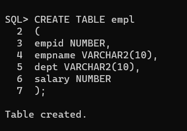
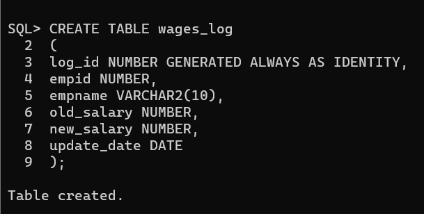
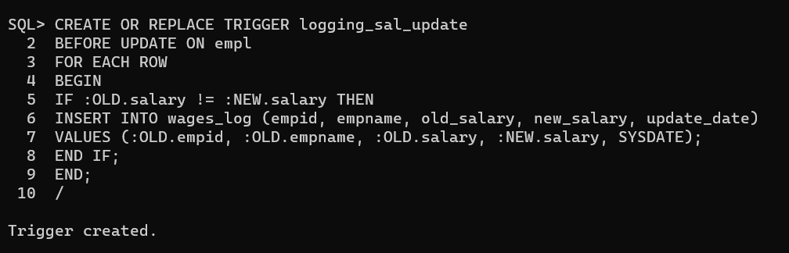
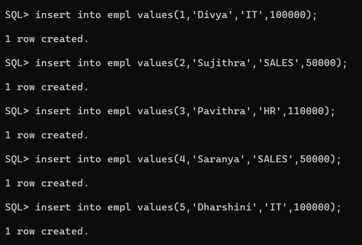
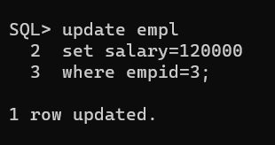
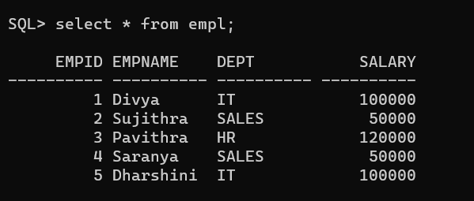
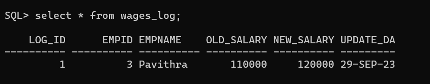

# Ex. No: 5 Creating Triggers using PL/SQL

### AIM: To create a Trigger using PL/SQL.

### Steps:
1. Create employee table with following attributes (empid NUMBER, empname VARCHAR(10), dept VARCHAR(10),salary NUMBER);
2. Create salary_log table with following attributes (log_id NUMBER GENERATED ALWAYS AS IDENTITY, empid NUMBER,empname VARCHAR(10),old_salary NUMBER,new_salary NUMBER,update_date DATE);
3. Create a trigger named as log_salary-update.
4. Inside the trigger block, Insert the values into the salary_log table whenever the salary is updated.
5. End the trigger.
6. Update the salary of an employee in employee table.
7. Whenever a salary is updated for the employee it must be logged into the salary_log table with old salary and new salary.
8. Display the employee table, salary_log table.

### Program:
### Create employee table:
```
CREATE TABLE empl
(
empid NUMBER,
empname VARCHAR2(10),
dept VARCHAR2(10),
salary NUMBER
);
```
## Create table for wages_log:
```
CREATE TABLE wages_log
(
log_id NUMBER GENERATED ALWAYS AS IDENTITY,
empid NUMBER,
empname VARCHAR2(10),
old_salary NUMBER,
new_salary NUMBER,
update_date DATE
);
```
## Create a trigger named logging_sal_update:
```
CREATE OR REPLACE TRIGGER logging_sal_update
BEFORE UPDATE ON empl
FOR EACH ROW
BEGIN
IF :OLD.salary != :NEW.salary THEN
INSERT INTO wages_log (empid, empname, old_salary, new_salary, update_date)
VALUES (:OLD.empid, :OLD.empname, :OLD.salary, :NEW.salary, SYSDATE);
END IF;
END;
/
```
## Inserting data into the employed table:
```
insert into empl values(1,'Divya','IT',100000);
insert into empl values(2,'Sujithra','SALES',50000);
insert into empl values(3,'Pavithra','HR',110000);
insert into empl values(4,'Saranya','SALES',50000);
insert into empl values(5,'Dharshini','IT',100000);
```
## Update the salary of an employed:
```
UPDATE empl
SET salary = 120000
where empid=3;
```
## Display the employee table:
```
select * from empl;
```
## Display the salary_log table:
```
select * from wages_log;
```


### Output:
## Create table for employee:

## Create table for wages_log:

## Create a trigger named logging_sal_update:

## Inserting data into the employed table:

## Update the salary of an employed:

## Display the employee table:

## Display the salary_log table:



### Result:
The program has been implemented successfully.
